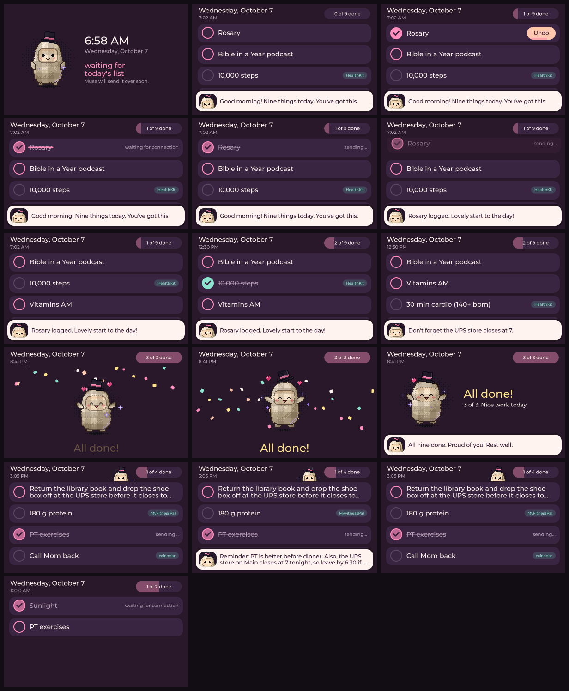

# Muse Todo Display

A touchscreen **desk** todo display for Muse (Meta's personal AI agent), powered by an ESP32.
Muse pushes the todo list to the screen (each morning and whenever it changes); tapping an
item crosses it out, the device tells Muse in a short chat message, shows Muse's reply, and
removes the item. Steps and cardio auto-complete from Apple HealthKit. Muse can also send
short messages to the screen.

## Hardware

- **Waveshare ESP32-S3 5" capacitive touch display** (800x480) — arrives ~Oct 13–15, 2026. Full spec, pin map, and quirks: `docs/01-hardware.md`.
- **Lamicall dock stand** (pink) — holds it upright on the desk.

## Documentation (start here if you're a coding agent)

| File | What it covers |
| --- | --- |
| `docs/00-start-here.md` | Intent, priorities, hard constraints, current status |
| `docs/01-hardware.md` | Board spec, pin map, RGB timing, quirks, variant check |
| `docs/02-board-support-port.md` | Adding the 5" board to the SDK by cloning its LCD-7 port (do first) |
| `docs/03-ui-spec.md` | Checklist UI, item lifecycle, message bar, celebration, item types |
| `docs/04-agent-integration.md` | Muse→device commands, device→Muse chat turns, outbox |
| `docs/05-open-questions-and-build.md` | Decisions for the owner, build/flash workflow |

## Status

Hardware ordered Oct 2, 2026; board arrives ~Oct 13–15. The todo UI runs on an 800x480
desktop simulator (`tools/sim.sh run`) with unit and screenshot tests (`tools/sim.sh test`).
Firmware glue and the board port come next. Both directions of the Muse link use documented
SDK mechanisms (custom commands in, typed chat turns out); the remaining unknown is whether
Muse calls device commands on a schedule — a small spike settles it.

## SDK

[facebookincubator/muse-gadget-sdk](https://github.com/facebookincubator/muse-gadget-sdk)
(Apache 2.0), ESP32 Device SDK, ESP-IDF v6.0.1. Pairing: SDK token from gadgets.muse.ai,
Muse app Settings > Devices (Developer mode), device advertises as `MuseGadget-XXXXXX`.
